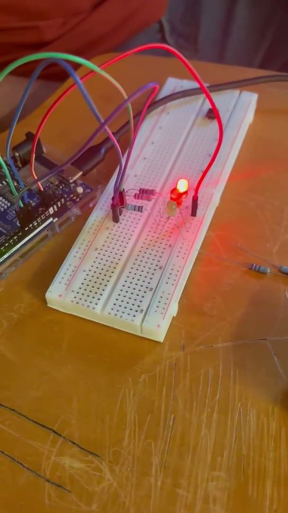
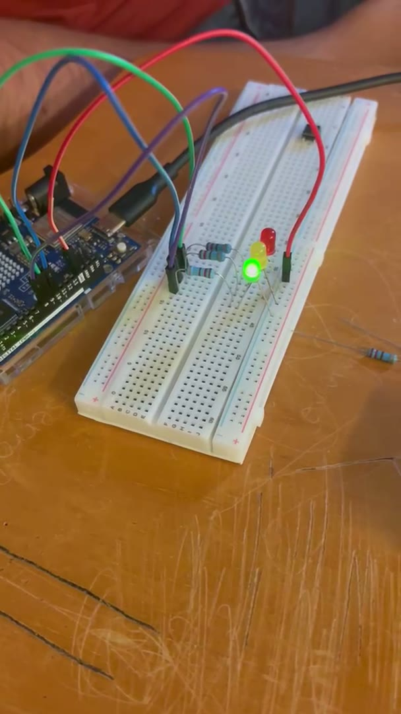
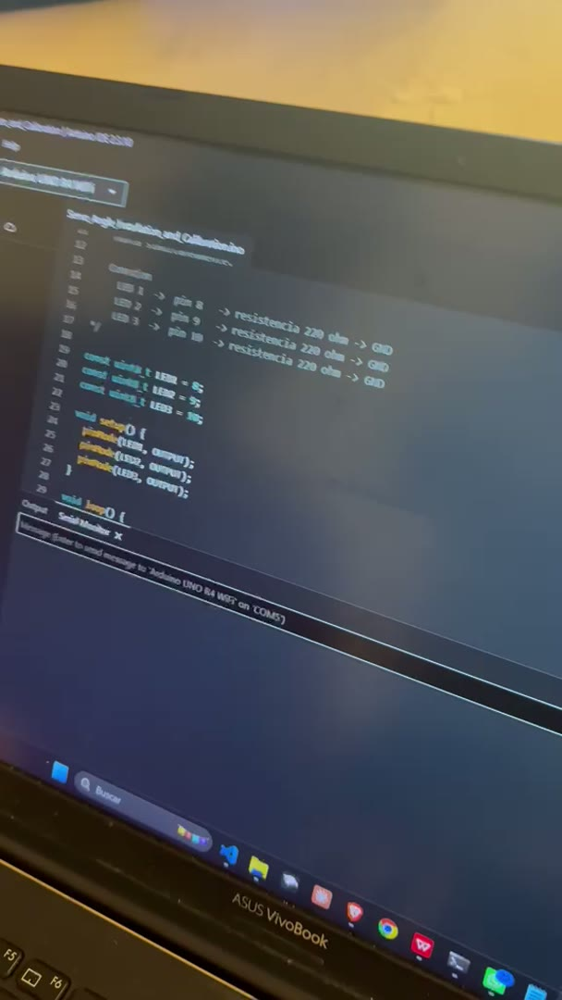

# Nombre del proyecto
Temporización no bloqueante — Parte 1: el antipatrón con `delay()`

## Descripción
Primera parte de la práctica 2.1.1. Se intenta que tres LEDs parpadeen a ritmos
distintos —**LED1 cada 500 ms, LED2 cada 1000 ms y LED3 cada 1500 ms**— con el enfoque
"intuitivo": encender, `delay()`, apagar, `delay()`, y así con cada LED.

El programa compila y los LEDs parpadean, pero **no a los ritmos pedidos**. `delay()`
detiene por completo la ejecución, así que mientras un LED "espera" los otros dos quedan
congelados en el estado en que estaban. El resultado es una sola secuencia de 6000 ms en
la que cada LED enciende una sola vez, en vez de tres tareas independientes.

Esta parte existe para ver el problema con los propios ojos; la
[Parte 2](../Practica-2-Temporizacion-No-Bloqueante-Parte-2-millis) lo resuelve con
`millis()` usando la misma conexión.

## Objetivos de aprendizaje
- Comprobar que `delay()` bloquea la ejecución del programa: durante la espera no se
  atiende nada más (ni otros LEDs, ni botones, ni el puerto serie).
- Entender por qué con retardos bloqueantes es imposible que varias tareas con
  periodos distintos convivan en un solo `loop()`.
- Reconocer el antipatrón para no repetirlo en sistemas que deban responder a
  varias cosas a la vez.

## Material utilizado

| Cantidad | Material |
|---|---|
| 1 | Arduino UNO R4 WiFi |
| 3 | LEDs (cualquier color) |
| 3 | Resistencias de 220 Ω |
| 1 | Protoboard |
| — | Cables Dupont macho-macho |

### Conexiones

| LED | Pin Arduino | Resistencia |
|---|---|---|
| LED 1 | 8 | 220 Ω a GND |
| LED 2 | 9 | 220 Ω a GND |
| LED 3 | 10 | 220 Ω a GND |

Cada LED va del pin a la pata larga (ánodo); la pata corta (cátodo) pasa por la
resistencia de 220 Ω a GND.

## Diagrama del circuito


Es el mismo circuito de la Parte 2: solo cambia el programa.

```
Pin 8  ──┤>├──[220 Ω]──┐
Pin 9  ──┤>├──[220 Ω]──┤
Pin 10 ──┤>├──[220 Ω]──┴── GND
```

## Código
[ParpadeoDelay.ino](Codigo/ParpadeoDelay/ParpadeoDelay.ino)

### Por qué no funciona

El `loop()` completo tarda 500+500+1000+1000+1500+1500 = **6000 ms** en dar una
vuelta, y en esa vuelta cada LED enciende una sola vez:

| Tiempo (ms) | LED1 | LED2 | LED3 | Qué está haciendo el programa |
|---|---|---|---|---|
| 0 – 500 | ON | off | off | `delay(500)` |
| 500 – 1000 | off | off | off | `delay(500)` |
| 1000 – 2000 | off | ON | off | `delay(1000)` |
| 2000 – 3000 | off | off | off | `delay(1000)` |
| 3000 – 4500 | off | off | ON | `delay(1500)` |
| 4500 – 6000 | off | off | off | `delay(1500)` |

Lo que se pedía era que en esos mismos 6000 ms LED1 encendiera **6 veces**, LED2 **3** y
LED3 **2**. Con `delay()` no hay forma de hacerlo: el procesador está ocupado "sin hacer
nada" y no puede revisar si a otro LED ya le toca cambiar.

Se puede maquillar (usar un `delay(500)` como paso base y contadores para los otros
dos LEDs), pero sigue siendo bloqueante: en cuanto se agregue una tarea que no sea
múltiplo de 500 ms, o un botón que deba responder al instante, vuelve a fallar. La
solución de verdad es no esperar: la Parte 2.

## Video del funcionamiento

[](https://www.youtube.com/shorts/sUPkjtxan6g)

**YouTube:** https://www.youtube.com/shorts/sUPkjtxan6g

Copia local: [Video/parpadeo-delay.mp4](Video/parpadeo-delay.mp4) · [Readme](Video/Readme.txt)

## Evidencias de armado

Cuadros tomados del video del funcionamiento. Se ve que los LEDs encienden **uno
después del otro** (rojo, amarillo, verde), nunca dos a la vez: es la secuencia
encadenada que produce `delay()`.

| | | |
|---|---|---|
|  |  |  |



## Reporte
[Readme](Reporte/Readme.txt)

<!-- PENDIENTE: Reporte de la practica.pdf -->

## Conclusiones

<!-- PENDIENTE: redactar. Puntos que conviene tocar:                              -->
<!-- - Que se vio en la protoboard: los LEDs encienden por turnos, uno tras otro,  -->
<!--   nunca dos al mismo tiempo, y el ciclo completo dura 6 s.                    -->
<!-- - delay() no es "esperar 500 ms para este LED", es "detener TODO 500 ms".      -->
<!-- - El programa no puede reaccionar a nada mientras espera (un boton, el serial).-->
<!-- - Por que esto importa en sistemas embebidos reales (sensores, comunicacion). -->

## Resultados
[Readme](Resultados/Readme.txt)

<!-- PENDIENTE: Resultados.pdf -->
