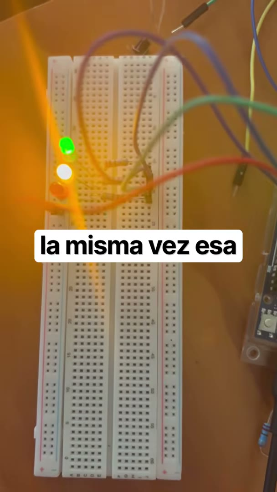
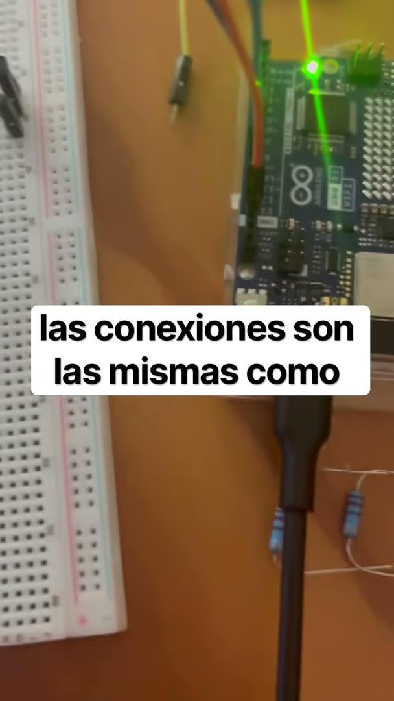

# Nombre del proyecto
Temporización no bloqueante — Parte 2: tres LEDs independientes con `millis()`

## Descripción
Segunda parte de la práctica 2.1.1. Los mismos tres LEDs de la
[Parte 1](../Practica-2-Temporizacion-No-Bloqueante-Parte-1-delay) parpadean a
**500 ms, 1000 ms y 1500 ms**, pero ahora **los tres al mismo tiempo y cada uno con su
propio ritmo**, sin un solo `delay()` en el programa.

La idea es no esperar nunca. Cada tarea recuerda *cuándo* actuó por última vez
(`ultimoCambio`) y en cada vuelta del `loop()` pregunta: "¿ya pasó mi periodo?". Si sí,
actúa y anota la hora; si no, deja pasar el turno. Como ninguna tarea detiene al
procesador, el `loop()` gira miles de veces por segundo y todas se atienden.

Se hizo también el **reto opcional**: una cuarta tarea imprime un mensaje en el Monitor
Serie cada 3 s. Se agregó sin tocar el código de los LEDs, que es la prueba de que la
estructura es realmente no bloqueante.

## Objetivos de aprendizaje
- Sustituir `delay()` por comparaciones con `millis()` para que varias tareas con
  periodos distintos convivan en un solo `loop()`.
- Usar el patrón `if (ahora - ultimoCambio >= periodo)` y entender por qué la resta
  en `unsigned long` sigue siendo correcta cuando `millis()` se desborda (a los ~49.7
  días).
- Organizar las tareas en un `struct` y un arreglo, de modo que agregar una tarea sea
  agregar un renglón y no reescribir el programa.
- Comprobar con una cuarta tarea (serial) que las demás no se ven afectadas.

## Material utilizado

| Cantidad | Material |
|---|---|
| 1 | Arduino UNO R4 WiFi |
| 3 | LEDs (cualquier color) |
| 3 | Resistencias de 220 Ω |
| 1 | Protoboard |
| — | Cables Dupont macho-macho |

### Conexiones

| LED | Pin Arduino | Resistencia | Periodo |
|---|---|---|---|
| LED 1 | 8 | 220 Ω a GND | 500 ms |
| LED 2 | 9 | 220 Ω a GND | 1000 ms |
| LED 3 | 10 | 220 Ω a GND | 1500 ms |

Es exactamente la misma conexión de la Parte 1; solo cambia el programa.

## Diagrama del circuito


```
Pin 8  ──┤>├──[220 Ω]──┐
Pin 9  ──┤>├──[220 Ω]──┤
Pin 10 ──┤>├──[220 Ω]──┴── GND
```

## Código
[ParpadeoMillis.ino](Codigo/ParpadeoMillis/ParpadeoMillis.ino)

### Cómo funciona

Cada LED es una entrada de esta lista:

```cpp
struct Parpadeo {
  int pin;
  unsigned long periodoMs;
  unsigned long ultimoCambio;
  bool encendido;
};

Parpadeo leds[] = {
  { 8,  500, 0, false },
  { 9, 1000, 0, false },
  { 10, 1500, 0, false },
};
```

y el `loop()` solo hace esto por cada una:

```cpp
if (ahora - leds[i].ultimoCambio >= leds[i].periodoMs) {
  leds[i].ultimoCambio = ahora;
  leds[i].encendido = !leds[i].encendido;
  digitalWrite(leds[i].pin, leds[i].encendido);
}
```

Con `delay()` el `loop()` daba una vuelta cada 6 s; aquí da una vuelta en
microsegundos, y por eso ningún LED tiene que esperar a otro.

### Lo que se ve en los primeros 3 segundos

| Tiempo (ms) | LED1 (500) | LED2 (1000) | LED3 (1500) |
|---|---|---|---|
| 0 | off | off | off |
| 500 | **ON** | off | off |
| 1000 | off | **ON** | off |
| 1500 | **ON** | ON | **ON** |
| 2000 | off | **off** | ON |
| 2500 | **ON** | off | ON |
| 3000 | off | **ON** | **off** |

Cada 3000 ms se repite el patrón (es el mínimo común múltiplo de los tres periodos) y
justo ahí cae el mensaje serial de la cuarta tarea.

### Sobre el desbordamiento de `millis()`

`millis()` es un `unsigned long` de 32 bits y vuelve a 0 después de 4 294 967 295 ms
(~49.7 días). La comparación `ahora - ultimoCambio >= periodo` no falla en ese momento
porque la resta entre `unsigned long` también "da la vuelta": si `ultimoCambio` fue
4 294 967 000 y `ahora` es 300, la resta da 596, que es la diferencia real. Lo que sí
fallaría es escribir `if (ahora >= ultimoCambio + periodo)`, y por eso no se usa así.

## Video del funcionamiento

[](https://www.youtube.com/shorts/pJ0OG_M3bCs)

**YouTube:** https://www.youtube.com/shorts/pJ0OG_M3bCs · [Readme](Video/Readme.txt)

## Evidencias de armado

Cuadros tomados del video del funcionamiento. A diferencia de la Parte 1, aquí sí
se ven **dos LEDs encendidos al mismo tiempo**: cada uno lleva su propio ritmo.

| | | |
|---|---|---|
|  |  |  |



## Reporte
[Readme](Reporte/Readme.txt)

<!-- PENDIENTE: Reporte de la practica.pdf -->

## Conclusiones

<!-- PENDIENTE: redactar. Puntos que conviene tocar:                                -->
<!-- - La diferencia visible con la Parte 1: ahora hay momentos con 2 o 3 LEDs       -->
<!--   encendidos a la vez y cada uno lleva su ritmo.                                 -->
<!-- - Cambio de mentalidad: en vez de "esperar X", "revisar si ya toca".             -->
<!-- - La cuarta tarea entro sin tocar las otras: que demuestra eso.                  -->
<!-- - Limite del patron: sigue siendo cooperativo; una tarea que tarde mucho         -->
<!--   (p. ej. un calculo largo) si retrasa a las demas.                              -->
<!-- - Por que la resta de unsigned long resuelve el desbordamiento de millis().      -->

## Resultados
[Readme](Resultados/Readme.txt)

<!-- PENDIENTE: Resultados.pdf -->
