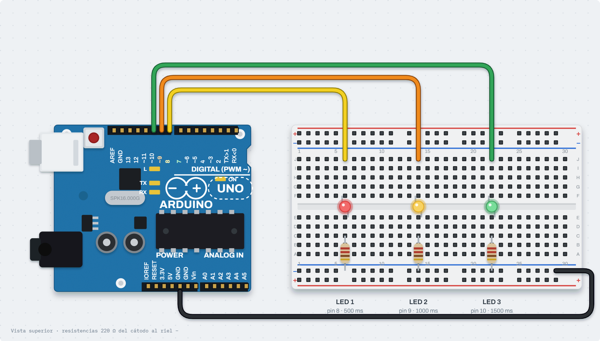
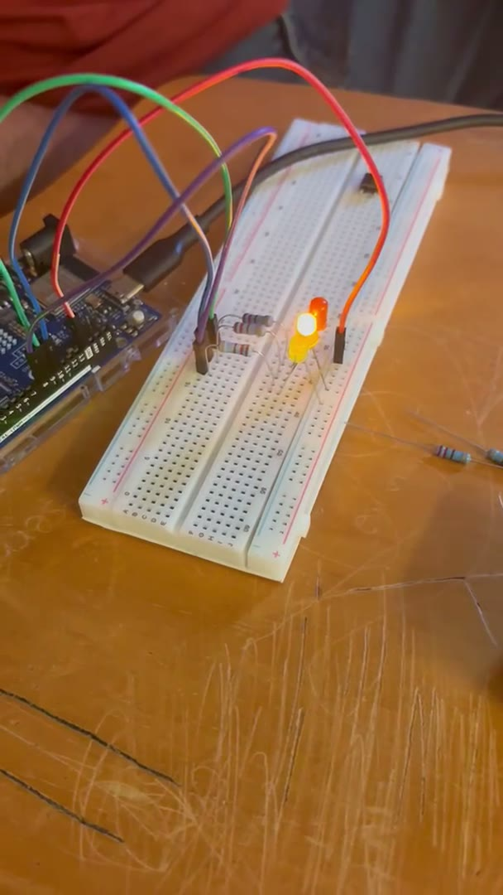
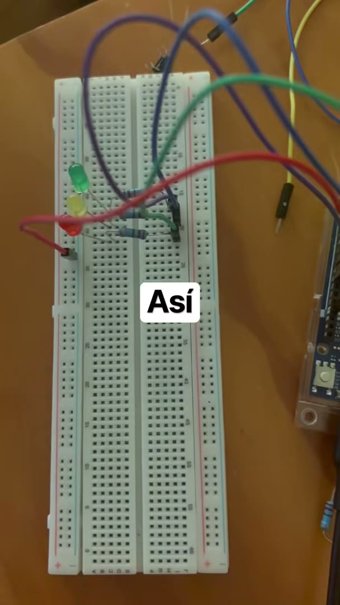
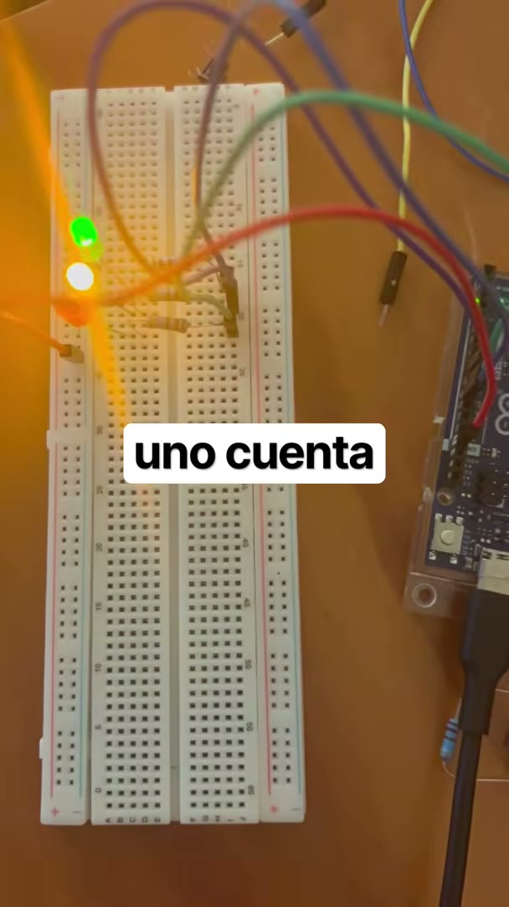

# Nombre del proyecto
Temporización no bloqueante: tres LEDs con `delay()` contra tres LEDs con `millis()`

## Descripción
Práctica 2.1.1 en dos partes sobre **el mismo circuito**: tres LEDs que deben parpadear
a ritmos distintos, **LED1 cada 500 ms, LED2 cada 1000 ms y LED3 cada 1500 ms**.

- **Parte 1 — `delay()` (el antipatrón).** El enfoque "intuitivo": encender, `delay()`,
  apagar, `delay()`, y así con cada LED. Compila y los LEDs parpadean, pero **no a los
  ritmos pedidos**: `delay()` detiene por completo la ejecución, así que mientras un LED
  "espera" los otros dos quedan congelados. El resultado es una sola secuencia de 6000 ms
  en la que cada LED enciende una sola vez.
- **Parte 2 — `millis()` (la solución).** Nadie espera. Cada tarea recuerda *cuándo* actuó
  por última vez y en cada vuelta del `loop()` pregunta "¿ya pasó mi periodo?". Como
  ninguna tarea detiene al procesador, los tres LEDs llevan su propio ritmo al mismo
  tiempo. Se hizo también el **reto opcional**: una cuarta tarea imprime en el Monitor
  Serie cada 3 s, agregada sin tocar el código de los LEDs.

El objetivo de hacer las dos partes es **comparar las dos formas de trabajar** con el
mismo hardware; la comparación está en [Resultados](#resultados).

## Objetivos de aprendizaje
- Comprobar que `delay()` bloquea la ejecución del programa: durante la espera no se
  atiende nada más (ni otros LEDs, ni botones, ni el puerto serie).
- Entender por qué con retardos bloqueantes es imposible que varias tareas con
  periodos distintos convivan en un solo `loop()`.
- Sustituir `delay()` por comparaciones con `millis()` usando el patrón
  `if (ahora - ultimoCambio >= periodo)`, y entender por qué la resta en `unsigned long`
  sigue siendo correcta cuando `millis()` se desborda (a los ~49.7 días).
- Organizar las tareas en un `struct` y un arreglo, de modo que agregar una tarea sea
  agregar un renglón y no reescribir el programa.
- Comprobar con una cuarta tarea (serial) que las demás no se ven afectadas.
- Comparar ambos enfoques con el mismo circuito y reconocer el antipatrón para no
  repetirlo en sistemas que deban responder a varias cosas a la vez.

## Material utilizado

| Cantidad | Material |
|---|---|
| 1 | Arduino UNO R4 WiFi |
| 3 | LEDs (cualquier color) |
| 3 | Resistencias de 220 Ω |
| 1 | Protoboard |
| — | Cables Dupont macho-macho |

### Conexiones

| LED | Pin Arduino | Resistencia | Periodo pedido |
|---|---|---|---|
| LED 1 | 8 | 220 Ω a GND | 500 ms |
| LED 2 | 9 | 220 Ω a GND | 1000 ms |
| LED 3 | 10 | 220 Ω a GND | 1500 ms |

Cada LED va del pin a la pata larga (ánodo); la pata corta (cátodo) pasa por la
resistencia de 220 Ω a GND. **Es la misma conexión para las dos partes: solo cambia el
programa.**

## Diagrama del circuito



```
Pin 8  ──┤>├──[220 Ω]──┐
Pin 9  ──┤>├──[220 Ω]──┤
Pin 10 ──┤>├──[220 Ω]──┴── GND
```

## Código

| Parte | Programa | Enfoque |
|---|---|---|
| 1 | [ParpadeoDelay.ino](Codigo/ParpadeoDelay/ParpadeoDelay.ino) | `delay()` bloqueante (antipatrón) |
| 2 | [ParpadeoMillis.ino](Codigo/ParpadeoMillis/ParpadeoMillis.ino) | `millis()` no bloqueante + reto del serial |

### Parte 1: por qué `delay()` no funciona

El `loop()` completo tarda 500+500+1000+1000+1500+1500 = **6000 ms** en dar una
vuelta, y en esa vuelta cada LED enciende una sola vez:

| Tiempo (ms) | LED1 | LED2 | LED3 | Qué está haciendo el programa |
|---|---|---|---|---|
| 0 – 500 | ON | off | off | `delay(500)` |
| 500 – 1000 | off | off | off | `delay(500)` |
| 1000 – 2000 | off | ON | off | `delay(1000)` |
| 2000 – 3000 | off | off | off | `delay(1000)` |
| 3000 – 4500 | off | off | ON | `delay(1500)` |
| 4500 – 6000 | off | off | off | `delay(1500)` |

Lo que se pedía era que en esos mismos 6000 ms LED1 encendiera **6 veces**, LED2 **3** y
LED3 **2**. Con `delay()` no hay forma de hacerlo: el procesador está ocupado "sin hacer
nada" y no puede revisar si a otro LED ya le toca cambiar. Se puede maquillar (usar un
`delay(500)` como paso base y contadores), pero sigue siendo bloqueante: en cuanto se
agregue una tarea que no sea múltiplo de 500 ms, o un botón que deba responder al
instante, vuelve a fallar.

### Parte 2: cómo funciona con `millis()`

Cada LED es una entrada de esta lista:

```cpp
struct Parpadeo {
  int pin;
  unsigned long periodoMs;
  unsigned long ultimoCambio;
  bool encendido;
};

Parpadeo leds[] = {
  { 8,  500, 0, false },
  { 9, 1000, 0, false },
  { 10, 1500, 0, false },
};
```

y el `loop()` solo hace esto por cada una:

```cpp
if (ahora - leds[i].ultimoCambio >= leds[i].periodoMs) {
  leds[i].ultimoCambio = ahora;
  leds[i].encendido = !leds[i].encendido;
  digitalWrite(leds[i].pin, leds[i].encendido);
}
```

Con `delay()` el `loop()` daba una vuelta cada 6 s; aquí da una vuelta en
microsegundos, y por eso ningún LED tiene que esperar a otro. Lo que se ve en los
primeros 3 segundos:

| Tiempo (ms) | LED1 (500) | LED2 (1000) | LED3 (1500) |
|---|---|---|---|
| 0 | off | off | off |
| 500 | **ON** | off | off |
| 1000 | off | **ON** | off |
| 1500 | **ON** | ON | **ON** |
| 2000 | off | **off** | ON |
| 2500 | **ON** | off | ON |
| 3000 | off | **ON** | **off** |

Cada 3000 ms se repite el patrón (es el mínimo común múltiplo de los tres periodos) y
justo ahí cae el mensaje serial de la cuarta tarea.

### Sobre el desbordamiento de `millis()`

`millis()` es un `unsigned long` de 32 bits y vuelve a 0 después de 4 294 967 295 ms
(~49.7 días). La comparación `ahora - ultimoCambio >= periodo` no falla en ese momento
porque la resta entre `unsigned long` también "da la vuelta": si `ultimoCambio` fue
4 294 967 000 y `ahora` es 300, la resta da 596, que es la diferencia real. Lo que sí
fallaría es escribir `if (ahora >= ultimoCambio + periodo)`, y por eso no se usa así.

## Video del funcionamiento

| Parte 1 — `delay()` | Parte 2 — `millis()` |
|---|---|
| [](https://www.youtube.com/shorts/sUPkjtxan6g) | [](https://www.youtube.com/shorts/pJ0OG_M3bCs) |
| https://www.youtube.com/shorts/sUPkjtxan6g | https://www.youtube.com/shorts/pJ0OG_M3bCs |

Copia local de la Parte 1: [Video/parpadeo-delay.mp4](Video/parpadeo-delay.mp4) · [Readme de la carpeta](Video/Readme.txt)

## Evidencias de armado

Cuadros tomados de los videos del funcionamiento.

**Parte 1 (`delay()`):** los LEDs encienden **uno después del otro** (rojo, amarillo,
verde), nunca dos a la vez: es la secuencia encadenada que produce `delay()`.

| | | |
|---|---|---|
|  |  |  |

**Parte 2 (`millis()`):** aquí sí se ven **dos LEDs encendidos al mismo tiempo**: cada
uno lleva su propio ritmo.

| | | |
|---|---|---|
|  |  |  |

## Reporte
[Reporte de la práctica — Temporización con `delay()` y `millis()` (PDF)](Reporte/Reporte-Temporizacion-delay-y-millis.pdf) · [qué contiene la carpeta](Reporte/Readme.txt)

Un solo reporte con las dos partes. Incluye:
- Datos generales, objetivo, tabla de conexiones, diagrama y procedimiento de cada parte
- Tabla de tiempos con `delay()` y tabla de tiempos con `millis()`
- Salida del Monitor Serie del reto (mensaje cada 3 s con el estado de los LEDs)
- Comparación de las dos formas de trabajar, observaciones, conclusiones y evidencia

## Conclusiones

`delay()` no significa "espera 500 ms para este LED": significa "detén todo el programa 500 ms". Mientras el procesador está dentro de un `delay()` no revisa ningún otro LED, ni un botón, ni el puerto serie; por eso en la Parte 1 los tres LEDs quedaron encadenados en una sola secuencia de 6 s y ninguno cumplió su periodo. En la protoboard se vio claro: encienden por turnos, nunca dos a la vez.

Con `millis()` la diferencia se ve a simple vista: hay instantes con dos y hasta tres LEDs encendidos al mismo tiempo, y cada uno lleva su ritmo. Con el mismo circuito, lo único que cambió fue la forma de esperar. El cambio es de mentalidad más que de código: en vez de "espera X ms" el programa dice "revisa si ya toca". Cada tarea recuerda cuándo actuó (`ultimoCambio`) y compara `ahora - ultimoCambio >= periodo`; como nadie detiene al procesador, el `loop()` gira miles de veces por segundo y todas las tareas se atienden.

La cuarta tarea del reto (mensaje serial cada 3 s) entró sin tocar una sola línea de los LEDs: solo se agregó otra comparación con su propio periodo. Eso demuestra que la estructura es realmente no bloqueante y que agregar tareas escala. Con `delay()` esa misma tarea habría obligado a reescribir todo el `loop()` y aun así habría llegado tarde.

La resta en `unsigned long` resuelve el desbordamiento de `millis()` a los ~49.7 días: cuando el contador da la vuelta, la diferencia también da la vuelta y sigue siendo la diferencia real. Escribir `ahora >= ultimoCambio + periodo` sí fallaría en ese momento.

El patrón tiene un límite: sigue siendo multitarea cooperativa. Si una tarea tarda mucho (un cálculo largo o un `delay()` escondido en una librería) retrasa a todas las demás. Para garantías de tiempo estrictas se necesitan interrupciones o temporizadores por hardware. Aun así, para un sistema embebido real (sensores que muestrean, comunicación que llega en cualquier momento, botones del usuario) la regla queda clara: no esperar nunca; el `delay()` es un antipatrón.

## Resultados
[Resultados de la práctica — Comparación `delay()` vs `millis()` (PDF)](Resultados/Resultados-Comparacion-delay-vs-millis.pdf) · [qué contiene la carpeta](Resultados/Readme.txt)

Comparación de las dos formas de trabajar con el mismo circuito:

| Aspecto | Parte 1 — `delay()` | Parte 2 — `millis()` |
|---|---|---|
| Ritmo de cada LED | Ninguno cumple su periodo: todos encadenados en un ciclo de 6 s | Cada uno cumple el suyo: 500 / 1000 / 1500 ms |
| Encendidos en 6 s (LED1 / LED2 / LED3) | 1 / 1 / 1 | 6 / 3 / 2 (lo pedido) |
| LEDs encendidos a la vez | Nunca más de uno | Hasta los tres (a los 1500 ms) |
| Duración de una vuelta del `loop()` | 6000 ms | Microsegundos |
| ¿Puede atender un botón o el serial mientras "espera"? | No: está bloqueado dentro del `delay()` | Sí: nunca espera, solo compara |
| Agregar una tarea nueva (el reto del serial cada 3 s) | Hay que reescribir la secuencia y aun así llega tarde | Un renglón más, sin tocar las otras |
| Uso del procesador | Ocupado "sin hacer nada" | Libre entre comparaciones |
| Desbordamiento de `millis()` | No aplica | Resuelto por la resta en `unsigned long` |
| Complejidad del código | Más corto, pero incorrecto | Un `struct` y un `for`; correcto y escalable |

El PDF incluye además las tablas de tiempos de cada parte y la salida del Monitor Serie
del reto.
