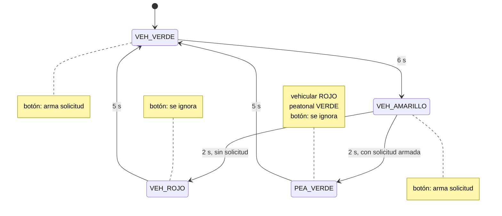

# Nombre del proyecto
Semáforo vehicular y peatonal con máquina de estados finitos (FSM)

## Descripción
Un semáforo vehicular de tres luces cicla solo: **VERDE → AMARILLO → ROJO → VERDE**.
Junto a él hay un semáforo peatonal de dos luces y un pulsador de cruce. El pulsador
no interrumpe nada de golpe: **arma una solicitud** que solo se acepta durante VERDE o
AMARILLO y se **atiende cuando el vehicular llega a ROJO**. En ese momento el peatonal
pasa a VERDE un tiempo fijo, regresa a ROJO y el ciclo vehicular reinicia. Si nadie
presiona el botón, el ciclo sigue sin detenerse a esperar a nadie.

Todo el programa está modelado como una **máquina de estados finitos** con cuatro
estados en un `enum class`, y la temporización es 100 % con `millis()`: no hay un solo
`delay()`, ni siquiera en el antirrebote del pulsador.

## Objetivos de aprendizaje
- Modelar un problema de control como FSM: estados, transiciones por tiempo y
  transiciones por evento (el botón), y llevarlo al código con un `switch` sobre el
  estado.
- Representar los estados con `enum class` y entender qué gana frente a un `enum`
  clásico: los valores quedan encapsulados (`Estado::VEH_ROJO`) y el compilador impide
  comparar estados de tipos distintos.
- Manejar una petición asíncrona (el peatón) sin romper la secuencia: la solicitud se
  "arma" y se atiende en el momento seguro.
- Leer un pulsador con antirrebote no bloqueante.
- Centralizar las salidas en una sola función (`aplicarSalidas`) para que las luces
  siempre correspondan al estado y nunca queden dos verdes encendidos.

## Material utilizado

| Cantidad | Material |
|---|---|
| 1 | Arduino UNO R4 WiFi |
| 3 | LEDs rojo, amarillo y verde — semáforo vehicular |
| 2 | LEDs rojo y verde — semáforo peatonal |
| 1 | Pulsador momentáneo normalmente abierto — botón de cruce |
| 5 | Resistencias de 220 Ω (una por LED) |
| 1 | Protoboard |
| — | Cables Dupont macho-macho |

El pulsador no necesita resistencia: se usa `INPUT_PULLUP` y el botón va del pin a GND.

### Conexiones

| Elemento | Pin Arduino | Nota |
|---|---|---|
| Vehicular VERDE | 8 | 220 Ω a GND |
| Vehicular AMARILLO | 9 | 220 Ω a GND |
| Vehicular ROJO | 10 | 220 Ω a GND |
| Peatonal ROJO | 11 | 220 Ω a GND |
| Peatonal VERDE | 12 | 220 Ω a GND |
| Pulsador | 2 | Otra pata a GND; `INPUT_PULLUP` (presionado = LOW) |

### Tiempos elegidos

| Fase | Duración | Constante |
|---|---|---|
| Vehicular VERDE | 6 s | `T_VERDE` |
| Vehicular AMARILLO | 2 s | `T_AMARILLO` (claramente más corto) |
| Vehicular ROJO sin peatón | 5 s | `T_ROJO` |
| Peatonal VERDE (vehicular en rojo) | 5 s | `T_PEATON` |
| Antirrebote del botón | 40 ms | `T_REBOTE` |

## Diagrama del circuito

<!-- PENDIENTE: foto del armado en la protoboard. Ver Diagrama/Readme.txt -->

```
Pin 8  ──┤>├ verde    ──[220 Ω]──┐
Pin 9  ──┤>├ amarillo ──[220 Ω]──┤   semáforo vehicular
Pin 10 ──┤>├ rojo     ──[220 Ω]──┤
Pin 11 ──┤>├ rojo     ──[220 Ω]──┤   semáforo peatonal
Pin 12 ──┤>├ verde    ──[220 Ω]──┤
Pin 2  ───[ pulsador ]───────────┴── GND
```

### Diagrama de estados



| Estado | Vehicular | Peatonal | Sale cuando |
|---|---|---|---|
| `VEH_VERDE` | verde | rojo | pasan 6 s → `VEH_AMARILLO` |
| `VEH_AMARILLO` | amarillo | rojo | pasan 2 s → `PEA_VERDE` si hay solicitud, si no `VEH_ROJO` |
| `VEH_ROJO` | rojo | rojo | pasan 5 s → `VEH_VERDE` |
| `PEA_VERDE` | rojo | verde | pasan 5 s → `VEH_VERDE` |

## Código
[SemaforoFSM.ino](Codigo/SemaforoFSM/SemaforoFSM.ino)

### Los estados

```cpp
enum class Estado {
  VEH_VERDE,     // vehicular verde,    peatonal rojo
  VEH_AMARILLO,  // vehicular amarillo, peatonal rojo
  VEH_ROJO,      // vehicular rojo,     peatonal rojo (sin solicitud)
  PEA_VERDE      // vehicular rojo,     peatonal verde (atendiendo la solicitud)
};
```

Con `enum class` hay que escribir `Estado::VEH_ROJO`; un `if (estado == 2)` o una
comparación contra otro enum no compila. Con un `enum` clásico eso pasaría en silencio.

### Cómo se atiende al peatón sin romper el ciclo

1. El `loop()` lee el botón con antirrebote no bloqueante (`botonPresionado()`).
2. Si el estado es `VEH_VERDE` o `VEH_AMARILLO`, pone `solicitudPeatonal = true`. En
   cualquier otro estado la pulsación se ignora y se avisa por serial.
3. Al terminar `VEH_AMARILLO` se decide la transición: con solicitud armada va a
   `PEA_VERDE` (vehicular rojo + peatonal verde 5 s); sin ella va a `VEH_ROJO` normal.
4. Desde cualquiera de los dos se regresa a `VEH_VERDE` y el ciclo continúa.

Las cinco luces las escribe solo `aplicarSalidas(estado)`, que se llama en cada cambio
de estado. Así es imposible que el peatonal esté en verde mientras el vehicular no
está en rojo.

### Salida del Monitor Serie (9600 baudios)

Cada transición imprime el instante y el estado nuevo, lo que sirve para verificar
los tiempos sin cronómetro:

```
Semaforo FSM (sin delay)
0 ms  -> VEH_VERDE
3210 ms  boton: solicitud peatonal ARMADA, se atiende en rojo
6000 ms  -> VEH_AMARILLO  (solicitud peatonal armada)
8000 ms  -> PEA_VERDE
13000 ms  -> VEH_VERDE
19000 ms  -> VEH_AMARILLO
21000 ms  -> VEH_ROJO
22500 ms  boton ignorado (fuera de verde/amarillo)
26000 ms  -> VEH_VERDE
```

## Video del funcionamiento

[Readme](Video/Readme.txt)

<!-- PENDIENTE: enlace de YouTube. Conviene mostrar: un ciclo sin tocar el boton,   -->
<!-- una pulsacion en verde (se atiende al llegar a rojo) y una pulsacion en rojo    -->
<!-- (se ignora).                                                                    -->

## Evidencias de armado

<!-- PENDIENTE: fotos del circuito armado. Ver Diagrama/Readme.txt -->

## Reporte
[Readme](Reporte/Readme.txt)

<!-- PENDIENTE: Reporte de la practica.pdf -->

## Conclusiones

<!-- PENDIENTE: redactar. Puntos que conviene tocar:                                  -->
<!-- - Que aporta pensar el semaforo como FSM antes de programarlo: cada estado dice   -->
<!--   que luces van y que lo saca de ahi; el codigo es la tabla de transiciones.       -->
<!-- - enum class vs enum: que error concreto evita.                                    -->
<!-- - La solicitud "armada": por que no se cambia de estado en el instante del boton.  -->
<!-- - millis() permite leer el boton todo el tiempo; con delay() la pulsacion se       -->
<!--   perderia mientras el programa espera.                                            -->
<!-- - Que se probo: pulsar en verde, en amarillo, en rojo, y no pulsar.                -->

## Resultados
[Readme](Resultados/Readme.txt)

<!-- PENDIENTE: Resultados.pdf -->
